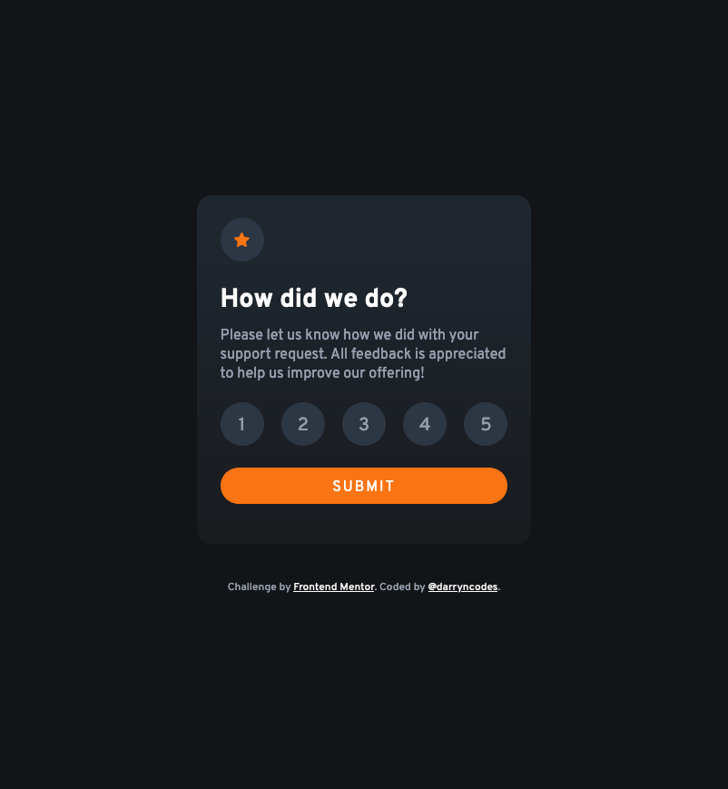

# Frontend Mentor - Interactive rating component solution

This is a solution to the [Interactive rating component challenge on Frontend Mentor](https://www.frontendmentor.io/challenges/interactive-rating-component-koxpeBUmI). Frontend Mentor challenges help you improve your coding skills by building realistic projects.

## Table of contents

- [Overview](#overview)
  - [The challenge](#the-challenge)
  - [Screenshot](#screenshot)
  - [Links](#links)
- [My process](#my-process)
  - [Built with](#built-with)
  - [What I learned](#what-i-learned)
- [Author](#author)

## Overview

### The challenge

Users should be able to:

- View the optimal layout for the app depending on their device's screen size
- See hover states for all interactive elements on the page
- Select and submit a number rating
- See the "Thank you" card state after submitting a rating

### Screenshot

### Links

- [GitHub repo](https://github.com/darryncodes/calculator-app)
- [Live URL](https://darryncodes.github.io/interactive-rating-component/)

## My process

### Built with

- Semantic HTML5 markup
- CSS
- React
- Flexbox
- Create React App
- Mobile-first workflow
- BEM methodology

### What I learned

An excellent opportunity to work with React. In particular passing data down with props, raising state up, useState, create react app and focussing on an accessible design with thw use of fieldset, radio inputs and hover/focus states.

## Author

- Work in progress portfolio site - [@darryncodes](https://www.darryncodes.co.uk/)
- Frontend Mentor - [@darryncodes](https://www.frontendmentor.io/profile/darryncodes)
- Twitter - [@darryncodes](https://twitter.com/darryncodes)
